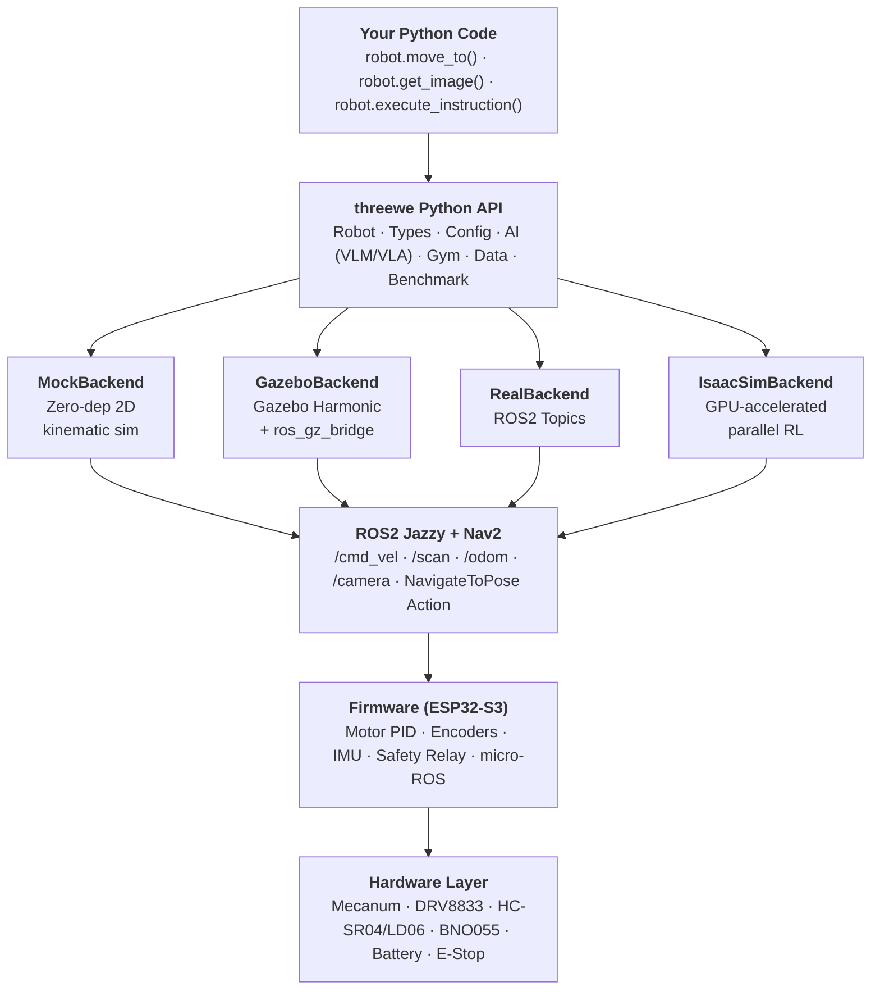

<div align="center">

# 3WE Robot Platform

**AI-First Open Infrastructure for Embodied Robotics**

[](LICENSE)
[](LICENSE-HARDWARE)
[](https://github.com/telleroutlook/3we-robot-platform/actions/workflows/python-tests.yml)
[-orange.svg)](sdk/threewe/)
[](https://ros.org/)

An open-source robot platform for Embodied AI research — a consistent Python API
across simulation and real hardware, with <$500 reproducible hardware.

> **A note on Sim2Real:** The Python API stays the same when you switch backends, but
> sim-to-real transfer in practice still requires task-specific tuning (sensor models,
> noise, dynamics). We provide presets for common scenarios; we don't claim the gap
> away. See [Sim-to-Real Gap](docs/sim_to_real_gap.md) for what works, what doesn't,
> and where you'll likely need to do downstream work.


*Autonomous navigation in office_v2 scene — 360° LiDAR, real-time obstacle avoidance, 4 lines of Python*

</div>

> **Note:** The animation above is a concept demo (generated with matplotlib), not a Gazebo simulation or real hardware recording. It illustrates the target API and navigation behavior.

### Try it now — 30 seconds, zero dependencies beyond numpy

<div align="center">

[](https://asciinema.org/a/akn7EAEkGo9VmOZv)

</div>

```bash
git clone https://github.com/telleroutlook/3we-robot-platform.git
cd 3we-robot-platform && pip install -e sdk/threewe/
python examples/navigate_office.py
```

> The recording was made with [`demo/record_demo.sh`](demo/record_demo.sh) — clone the repo and run it yourself to verify.

---

## 5 Lines to a Moving Robot

```python
from threewe import Robot

async with Robot(backend="mock") as robot:
    image = robot.get_image()
    await robot.move_to(x=2.0, y=1.0)
    pose = robot.get_pose()
```

Switch `backend="mock"` to `backend="gazebo"` or `backend="real"` — the Python API stays the same. Sensor models and sim configs may still need task-specific tuning; see [Sim-to-Real Gap](docs/sim_to_real_gap.md).

---

## Why 3we?

| If you are... | 3we gives you... | Start here |
|:---|:---|:---|
| **AI/ML Researcher** | Gymnasium envs, VLM/VLA integration, trajectory recording — focus on your model, not ROS2 | [Getting Started (AI)](docs/getting_started_ai.md) |
| **Robotics Student** | Full stack from PCB to Python, <$500 hardware, production-grade code instead of toy examples | [Getting Started (Basic)](docs/getting_started_basic.md) |
| **RL Practitioner** | `gymnasium.make("3we/Navigation-v1")` — standard RL interface with sim-to-real presets for common tasks | [Getting Started (AI)](docs/getting_started_ai.md) |
| **Hardware Builder** | Open BOM, assembly guide, CERN-OHL-P licensed PCB + structure | [Assembly Guide](docs/assembly_guide.md) |

---

## Quick Start

> **Status:** The `threewe` SDK is under active development. `pip install threewe` is not yet available on PyPI. Install from source to try it today:

```bash
git clone https://github.com/telleroutlook/3we-robot-platform.git
cd 3we-robot-platform
pip install -e sdk/threewe/
```

```python
import asyncio
from threewe import Robot

async def main():
    # "mock" backend works immediately — no ROS2 or Gazebo required
    async with Robot(backend="mock") as robot:
        # Navigate
        result = await robot.move_to(x=2.0, y=1.0)
        print(f"Reached: {result.success}")

        # VLM-powered instruction (requires: pip install threewe[ai])
        result = await robot.execute_instruction("go to the red door")

        # Get sensor data
        scan = robot.get_lidar_scan()
        imu = robot.get_imu()

asyncio.run(main())
```

> **Backends**: Use `backend="mock"` to try the API instantly, `"gazebo"` for physics simulation (requires ROS2), `"isaac_sim"` for GPU-accelerated parallel simulation, or `"real"` for physical hardware.

<details>
<summary><b>Actual output (from the recording above)</b></summary>

```console
$ pip install -e sdk/threewe/
Successfully installed threewe-0.1.0a0

$ python examples/navigate_office.py
============================================================
  3we Robot Platform — Office Navigation Demo
============================================================

[3we] Robot initialized  backend=mock  scene=office_v2

  Start pose: (1.0, 1.0)
  LiDAR: 360 rays, nearest obstacle: 0.99m

  Following path: 5 waypoints

[3we] Navigating to (2.0, 3.0)...
[3we] Planning path... distance=2.2m
[3we]   pos=(1.5, 2.1)  heading=63°  remaining=1.0m
[3we] Goal reached  distance=2.2m  time=4.5s
[3we] Navigating to (7.0, 3.5)...
[3we] Planning path... distance=5.0m
[3we]   pos=(4.0, 3.2)  heading=6°  remaining=3.0m
[3we] Goal reached  distance=5.0m  time=10.0s
...

  Final pose: (12.0, 10.0)
  Total distance: 20.5m
  Result: success

============================================================
```

</details>

### RL Training

```python
import gymnasium
import threewe.gym  # registers environments

env = gymnasium.make("3we/Navigation-v1")
obs, info = env.reset()

for _ in range(1000):
    action = env.action_space.sample()
    obs, reward, terminated, truncated, info = env.step(action)
    if terminated or truncated:
        obs, info = env.reset()
```

### Benchmarks

```bash
threewe benchmark run --task pointnav --episodes 100 --backend gazebo
```

See the [Benchmark Leaderboard](docs/leaderboard.md) for baseline results and submission instructions.

---

## Capabilities

| Capability | Status | Details |
|------------|--------|---------|
| Consistent Python API across backends | ✅ Ready | 4 backends (mock/gazebo/isaac_sim/real), same Robot class — task-specific sim tuning still required ([details](docs/sim_to_real_gap.md)) |
| Imitation Learning Data | ✅ Ready | `save_lerobot()` export + HuggingFace Hub push/pull |
| VLM/LLM Control | ✅ Ready | GPT-4o / Qwen-VL, async API decoupled from 50Hz control loop |
| Hardware Safety | ✅ Ready | 3-tier watchdog: 500ms cmd_vel timeout, 1s software WDT, 1.6s hardware WDT (TPS3813) |
| RL Gymnasium Envs | ✅ Ready | 4 standard envs (PointNav, Exploration, ObjectNav, VLN) + multi-agent |
| Edge AI Inference | ✅ Ready | Hailo-8L M.2 accelerator (13 TOPS) on Raspberry Pi 5 |
| VLA Model Deploy | ✅ Ready | ONNX / PyTorch / Hailo HEF, `from_pretrained()` from Hub |
| Domain Randomization | ✅ Ready | Physics, visual, and sensor noise — configurable per-episode |
| RGB-D Depth Camera | ✅ Ready | `get_rgbd_image()` API, native depth in Isaac Sim |
| Modular Install | ✅ Ready | `threewe` / `threewe[sim]` / `threewe[ai]` / `threewe[all]` |

---

## Architecture



---

## Platform Comparison

> Different tools for different needs. This table highlights where 3we fits — it is not a claim of superiority.

| Feature | **3we** | TurtleBot 4 | LeRobot | Isaac Lab |
|:--------|:---:|:---:|:---:|:---:|
| Python API (no ROS2 knowledge needed) | Yes | No | N/A | Partial |
| Same API, mock → sim → real | Yes | No | No | Yes |
| Open Hardware (PCB + BOM) | Full | Partial | N/A | N/A |
| Gymnasium Interface | Yes | No | Partial | Yes |
| VLM/VLA Integration | Yes | No | Yes | No |
| Hardware Cost | <$500 | ~$1200 | ~$2000+ | N/A |
| Payload Hot-plug Bus | PBC-34 | USB | N/A | N/A |
| Safety (HW E-stop) | Yes | Software | N/A | N/A |
| Community / Maturity | Early stage | Established | Active | Active |

---

## Hardware Specs

| Spec | Standard v2 |
|:-----|:---|
| Drive | 4-wheel Mecanum (65mm), omnidirectional |
| MCU | ESP32-S3 (dual-core 240MHz) |
| SBC | Raspberry Pi 5 (8GB) |
| AI Accelerator | Hailo-8L (13 TOPS) |
| LiDAR | LD06 (360°, 12m range) |
| IMU | BNO055 (9-axis fused) |
| Max Velocity | 0.5 m/s linear, 1.0 rad/s angular |
| Battery | 7.4V Li-ion, ~2h runtime |
| Safety | ISO 13850 E-stop + dual-channel relay |
| Connectivity | Wi-Fi + BLE (+ 4G/5G optional) |
| Reproduction Cost | <$500 |

---

## Repository Structure

```
3we-robot-platform/
├── sdk/threewe/          # AI-First Python package (pip install threewe)
│   ├── src/threewe/      #   Robot, Types, Backends, Gym, AI, Data, Benchmark
│   └── tests/            #   309 unit tests
├── examples/             # Ready-to-run demo scripts
├── firmware/             # ESP32-S3 firmware (ESP-IDF + micro-ROS)
├── ros2_ws/              # ROS2 packages (Nav2, SLAM, Gazebo, Perception)
├── hardware/             # Open hardware (KiCad PCB, BOM, mechanical)
├── sdk/payload_interface/# Payload communication library
├── sdk/web_control/      # TypeScript Web Components control panel
├── monitoring/           # Prometheus + Grafana observability
└── docs/                 # Guides, API reference, tutorials
```

---

## Installation Options

> **Current**: Install from source with `pip install -e sdk/threewe/`. The commands below will work once the package is published to PyPI.

```bash
# Core (types, Robot class, config)
pip install threewe

# With simulation (adds gymnasium)
pip install threewe[sim]

# With AI integration (adds openai, Pillow)
pip install threewe[ai]

# With data recording (adds h5py)
pip install threewe[data]

# Everything
pip install threewe[all]
```

For the **real hardware** backend, you also need ROS2 Jazzy:
```bash
# Ubuntu 24.04
sudo apt install ros-jazzy-desktop
```

---

## Examples

| Script | Description | Backend |
|:-------|:-----------|:--------|
| [`navigate_office.py`](examples/navigate_office.py) | Multi-waypoint navigation with verbose output | mock |
| [`hello_world.py`](examples/hello_world.py) | Connect, capture image, navigate | mock |
| [`rl_obstacle_avoidance.py`](examples/rl_obstacle_avoidance.py) | PPO training in simulation | mock |
| [`slam_exploration.py`](examples/slam_exploration.py) | Autonomous SLAM exploration | mock |
| [`data_collection.py`](examples/data_collection.py) | Record trajectories for imitation learning | mock |
| [`vlm_navigation.py`](examples/vlm_navigation.py) | GPT-4o visual navigation | mock + API key |
| [`sim2real_demo.py`](examples/sim2real_demo.py) | Same code, different backends | gazebo |

### Jupyter Notebooks

Step-by-step tutorials in [`notebooks/`](notebooks/). Most require ROS2 + Gazebo unless noted:

| Notebook | Topic | Requires |
|:---------|:------|:---------|
| [01_hello_world](notebooks/01_hello_world.ipynb) | Connect, sensors, basic navigation | Gazebo |
| [02_slam_exploration](notebooks/02_slam_exploration.ipynb) | Autonomous mapping | Gazebo |
| [03_point_navigation](notebooks/03_point_navigation.ipynb) | Waypoints and path following | Gazebo |
| [04_rl_training](notebooks/04_rl_training.ipynb) | Gymnasium + PPO training | mock (works standalone) |
| [05_data_collection](notebooks/05_data_collection.ipynb) | Record trajectories, export to LeRobot | Gazebo |

---

## Roadmap

- [x] **Phase 1**: ESP32 firmware + ROS2 stack + Hardware design
- [x] **Phase 1**: `threewe` Python API + Mock backend
- [x] **Phase 1**: Gymnasium environments + VLM/VLA integration
- [x] **Phase 1**: Benchmark framework + Example scripts
- [ ] **Phase 1**: Gazebo/Isaac Sim backends (interface done, integration testing in progress)
- [ ] **Phase 1**: PyPI publishing (`pip install threewe`)
- [x] **Phase 2**: On-robot status display panel (1.3" OLED SH1106, 3-key navigation, 5 pages, fault codes)
- [ ] **Phase 2**: Hardware Abstraction Layer for 3rd-party robots
- [ ] **Phase 2**: Foundation model fine-tuning pipelines
- [ ] **Phase 3**: 3we Hub (model/dataset sharing)
- [ ] **Phase 3**: Multi-robot fleet management

---

## Blog & Dev Notes

Engineering deep-dives at [3we.org/blog](https://3we.org/blog/overview/):

| Post | Topic |
|:-----|:------|
| [Dev Log #1: Why These Parts](https://3we.org/blog/dev-log-001/) | ESP32-S3 vs STM32, mecanum wheels, PBC-34 bus design, honest project status |
| [Sim2Real: Same Code to Real Hardware](https://3we.org/blog/sim2real-practice/) | Backend abstraction, domain randomization, validation protocol |
| [Build a $300 ROS2 Research Robot](https://3we.org/blog/build-robot/) | Complete BOM, assembly, software setup |
| [30 Lines: Let GPT-4o Control a Robot](https://3we.org/blog/vlm-control/) | VLM perception-action loop, local model support |

---

## Licensing

| Component | License | File |
|:----------|:--------|:-----|
| Firmware & Software | Apache License 2.0 | [`LICENSE`](LICENSE) |
| Hardware Designs | CERN-OHL-P v2 | [`LICENSE-HARDWARE`](LICENSE-HARDWARE) |
| Documentation | CC BY-SA 4.0 | [`LICENSE-DOCS`](LICENSE-DOCS) |

### Attribution

Commercial use is welcome and free of charge. The licenses require that derivative
works include attribution to this project. Recommended format:

> This product is based on the open-source [3we Robot Platform](https://github.com/telleroutlook/3we-robot-platform).

For academic citations, see [`CITATION.cff`](CITATION.cff).

---

## Contributing

We welcome contributions! See **[CONTRIBUTING.md](CONTRIBUTING.md)** for development setup, branch strategy, and PR process.

---

## Safety Notice

> [!WARNING]
> This platform contains **moving mechanical parts** and **lithium batteries**.

- Always verify E-stop function before operation
- Never bypass or modify the safety relay circuit
- Follow battery handling guidelines in documentation

---

<div align="center">

Copyright 2025-2026 [telleroutlook](https://github.com/telleroutlook) · [3we-robot-platform](https://github.com/telleroutlook/3we-robot-platform)

</div>
