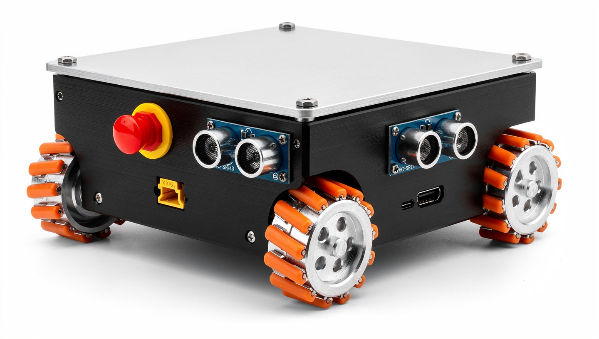

<div align="center">

# 3WE Robot Platform

**Universal Modular Mobile Platform**

[](LICENSE)
[](LICENSE-HARDWARE)
[](LICENSE-DOCS)
[](https://ros.org/)
[](https://github.com/espressif/esp-idf)

[](https://www.espressif.com/en/products/socs/esp32-s3)
[](https://ros.org/)
[](https://python.org/)
[](https://www.typescriptlang.org/)
[](https://www.kicad.org/)
[](../../actions)

An open-source omnidirectional mobile robot platform designed for<br/>
**modularity**, **extensibility**, and **rapid payload integration**.



[Getting Started](#-quick-start) &bull;
[Documentation](docs/) &bull;
[Contributing](CONTRIBUTING.md) &bull;
[Hardware](hardware/)

**[English](README.md) | [中文](README_zh.md)**

</div>

---

> [!NOTE]
> This project is under active development. Hardware designs and firmware are being validated.

<br/>

## ✦ Core Capabilities

<table>
<tr>
<td width="50%">

**Motion & Control**
- Omnidirectional mecanum drive
- Closed-loop PID with encoder feedback
- 50 Hz control loop, < 20 ms latency
- Configurable speed limit (max 1.2 m/s)

</td>
<td width="50%">

**Intelligence & Navigation**
- Edge AI inference (Hailo-8/8L)
- Nav2 autonomous navigation
- SLAM with slam_toolbox
- ROS2 native integration

</td>
</tr>
<tr>
<td>

**Safety & Security**
- ISO 13850 hardware E-stop
- Dual-channel safety relay with self-test
- DTLS 1.2 encrypted communication
- Ed25519 signed OTA updates

</td>
<td>

**Modularity & Extensibility**
- PBC-34 hot-plug payload bus
- EEPROM auto-identification
- Power sequencing & budget management
- Multi-protocol: Wi-Fi / BLE / 4G / 5G / LoRa

</td>
</tr>
</table>

<br/>

## ✦ Why This Project

| Pain Point | How We Solve It |
|:-----------|:----------------|
| Building a robot platform from scratch takes months | Complete open-source stack: hardware → firmware → ROS2 → SDK, ready to customize |
| Most platforms have closed hardware designs | Fully open PCB (KiCad) + mechanical drawings under CERN-OHL-P |
| No standard payload interface exists | PBC-34 hot-plug bus with EEPROM auto-discovery — plug in your sensor and go |
| Education platforms don't scale to industry | 3 SKUs from classroom (Basic) to factory floor (Industrial) — same codebase |
| Security is bolted on as an afterthought | DTLS 1.2 encrypted comms + signed OTA + hardware E-stop from day one |

### Who Is This For?

- **Students & Educators** — Learn real embedded systems, ROS2, and mechatronics with production-grade code instead of toy examples
- **Researchers** — Skip 6 months of platform building; focus on your algorithm with a validated, sensor-fused base
- **Product Developers** — Prototype to product on the same platform; swap SKU configs without rewriting code
- **Industrial Integrators** — IP65, CAN bus, 5G, hardware safety relays — deploy in real facilities with confidence

<br/>

## ✦ Product Line

| | **Basic** | **Standard** | **Industrial** |
|:--|:--:|:--:|:--:|
| **Target** | Education | Research / Development | Industrial deployment |
| **Chassis** | 300×250 mm | 400×320 mm | 500×400 mm |
| **Wheels** | 48 mm Mecanum | 65 mm Mecanum | 97 mm Mecanum |
| **Payload** | 1 kg | 5 kg | 15 kg |
| **AI** | — | Hailo-8L (13 TOPS) | Hailo-8 (26 TOPS) |
| **Connectivity** | Wi-Fi + BLE | Wi-Fi + BLE | + 5G + LoRa |
| **CAN Bus** | — | — | MCP2515 + TJA1050 |
| **Protection** | IP20 | IP20 | IP54 |

Optional add-ons for Standard: Hailo-8 upgrade, 4G modem, LD06 LiDAR, rear camera.

<br/>

## ✦ Architecture

```
┌───────────────────────────────────────────────────────────┐
│                       Payload Layer                         │
│            User devices via PBC-34 connector               │
├───────────────────────────────────────────────────────────┤
│                    Application Layer                        │
│          ROS2  ·  Nav2  ·  SLAM  ·  Custom Nodes          │
├───────────────────────────────────────────────────────────┤
│                     Compute Layer                           │
│          Raspberry Pi 5  +  AI Accelerator (Hailo)         │
├───────────────────────────────────────────────────────────┤
│                     Firmware Layer                          │
│     ESP32-S3  ·  Motor  ·  Sensors  ·  Safety  ·  Comm    │
├───────────────────────────────────────────────────────────┤
│                     Hardware Layer                          │
│   Mecanum Wheels  ·  DRV8833  ·  Battery  ·  E-Stop       │
└───────────────────────────────────────────────────────────┘
```

<br/>

## ✦ Repository Structure

```
robot-platform/
│
├── firmware/                    # ESP32-S3 firmware (ESP-IDF + micro-ROS)
│   ├── esp32/main/             #   Application source
│   └── config/                 #   Pin definitions, robot parameters
│
├── ros2_ws/                    # ROS2 workspace
│   ├── robot_bringup/          #   Launch files, Nav2/SLAM config
│   ├── robot_description/      #   URDF model (Xacro)
│   ├── robot_diagnostics/      #   Health monitoring, metrics
│   ├── robot_interfaces/       #   Custom msg/srv definitions
│   ├── robot_perception/       #   Camera + AI inference (Hailo)
│   └── robot_simulation/       #   Gazebo simulation
│
├── hardware/                   # Hardware design
│   ├── pcb/                    #   PCB specs, PBC-34 pinout
│   ├── structure/              #   Mechanical drawings
│   └── bom/                    #   Bill of materials (3 SKUs + optional add-ons)
│
├── sdk/                        # Payload developer toolkit
│   ├── payload_interface/      #   Python communication library
│   ├── tools/                  #   EEPROM validator, diagnostics
│   ├── examples/               #   Reference implementations
│   ├── web_control/            #   TypeScript Web Components (Lit)
│   └── web_basic/              #   Browser-based teleop UI
│
└── docs/                       # Documentation
    ├── assembly_guide.md       #   Hardware assembly
    ├── firmware_guide.md        #   Build & flash guide
    ├── pbc34_payload_guide.md  #   Payload development reference
    ├── compliance_checklist.md #   Regulatory compliance
    └── performance_benchmarks.md
```

<br/>

## ✦ Quick Start

### Prerequisites

| Tool | Version | Purpose |
|------|---------|---------|
| [ESP-IDF](https://docs.espressif.com/projects/esp-idf/en/latest/esp32s3/get-started/) | v5.x | Firmware build toolchain |
| [ROS2](https://docs.ros.org/en/humble/Installation.html) | Humble / Jazzy | Robot middleware |
| Python | 3.10+ | SDK and tools |
| [KiCad](https://www.kicad.org/) | 8+ | Hardware modifications (optional) |

### 1. Build & Flash Firmware

```bash
cd firmware/esp32
idf.py set-target esp32s3
idf.py build
idf.py flash monitor
```

### 2. Build ROS2 Workspace

```bash
cd ros2_ws
colcon build --symlink-install
source install/setup.bash
```

### 3. Launch the Robot

```bash
ros2 launch robot_bringup robot.launch.py
```

<br/>

## ✦ Tech Stack

| Layer | Technology | Role |
|:------|:-----------|:-----|
| MCU | ESP32-S3 | Dual-core 240 MHz, Wi-Fi + BLE |
| SBC | Raspberry Pi 5 (8 GB) | ROS2, navigation, vision |
| AI | Hailo-8L / Hailo-8 | 13–26 TOPS edge inference |
| RTOS | FreeRTOS (ESP-IDF) | Real-time motor + sensor control |
| Middleware | micro-ROS ↔ ROS2 | MCU–SBC bridge |
| Navigation | Nav2 + slam_toolbox | SLAM and path planning |
| Motor Driver | DRV8833 x2 | 4 × DC motor H-bridge |
| Security | DTLS 1.2 + Ed25519 OTA | Encrypted control, signed updates |
| Safety | ISO 13850 E-stop | Hardware interlock |

<br/>

## ✦ Comparison with Alternatives

| Feature | **This Project** | TurtleBot 4 | Linorobot2 | ROSbot XL | Yahboom X3 |
|:--------|:---:|:---:|:---:|:---:|:---:|
| **Open Hardware** | Full (CERN-OHL-P) | Partial | Partial | Closed | Closed |
| **Mecanum Drive** | 4-wheel omnidirectional | Differential | Configurable | Mecanum | Mecanum |
| **Payload System** | PBC-34 hot-plug bus | USB/serial | None | GPIO header | None |
| **Encrypted Comms** | DTLS 1.2 | None | None | None | None |
| **Multi-SKU** | 3 variants (1 codebase) | Single | Single | 2 variants | Single |
| **Web Control UI** | Built-in (TypeScript) | Via RViz | None | ROSbot UI | App only |
| **HW Safety Relay** | ISO 13850 + self-test | Software only | None | Software only | None |

This platform occupies a unique position: **fully open hardware with production-grade security**, bridging the gap between educational kits and closed industrial robots. No other open-source platform combines a standardized payload bus, encrypted communication, and multi-SKU scalability in a single architecture.

> See **[docs/competitive_analysis.md](docs/competitive_analysis.md)** for detailed multi-dimensional comparison.

<br/>

## ✦ Licensing

This project uses an **Open Core** multi-license structure:

| Component | License | File |
|:----------|:--------|:-----|
| Firmware & Software | Apache License 2.0 | [`LICENSE`](LICENSE) |
| Hardware Designs | CERN-OHL-P v2 | [`LICENSE-HARDWARE`](LICENSE-HARDWARE) |
| Documentation | CC BY-SA 4.0 | [`LICENSE-DOCS`](LICENSE-DOCS) |

Third-party attributions: [`NOTICE`](NOTICE)

<br/>

## ✦ Contributing

We welcome contributions! See **[CONTRIBUTING.md](CONTRIBUTING.md)** for:

- Development environment setup
- Branch strategy & conventional commits
- Pull request process
- Safety-critical contribution rules

<br/>

## ✦ Safety Notice

> [!WARNING]
> This platform contains **moving mechanical parts** and **lithium batteries**.

- Always verify E-stop function before operation
- Never bypass or modify the safety relay circuit
- Follow battery handling guidelines in documentation
- Keep clear of wheel assemblies during operation

<br/>

## ✦ Community & Support

| Channel | Purpose |
|---------|---------|
| [GitHub Issues](../../issues) | Bug reports, feature requests |
| [GitHub Discussions](../../discussions) | Questions, ideas, show & tell |

<br/>

## ✦ Acknowledgments

Built on the shoulders of:

| Project | Maintainer |
|---------|-----------|
| [ESP-IDF](https://github.com/espressif/esp-idf) | Espressif Systems |
| [micro-ROS](https://micro.ros.org/) | eProsima |
| [ROS 2](https://ros.org/) | Open Robotics |
| [Nav2](https://nav2.org/) | Steve Macenski et al. |
| [KiCad](https://www.kicad.org/) | KiCad Community |

---

<div align="center">
<sub>Made with care for the robotics community.</sub>
</div>
