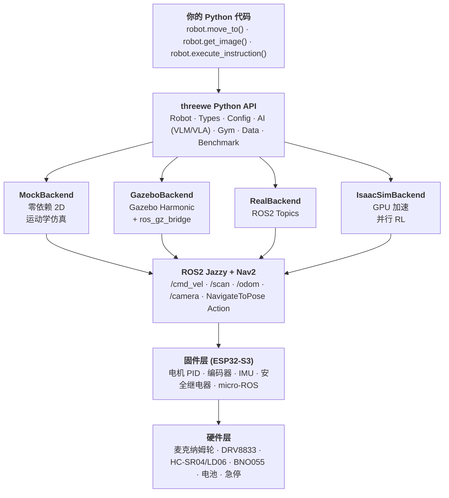

<div align="center">

# 3WE Robot Platform

**AI-First 开源具身智能基础设施**

[](LICENSE)
[](LICENSE-HARDWARE)
[](https://github.com/telleroutlook/3we-robot-platform/actions/workflows/python-tests.yml)
[-orange.svg)](sdk/threewe/)
[](https://ros.org/)

面向具身 AI 研究的开源机器人平台 —— 仿真与真机使用一致的 Python API，
硬件复现成本 <$500。

> **关于 Sim2Real 的说明：** 切换后端时 Python API 保持一致，但实际的 sim-to-real
> 迁移仍需要针对任务调整（传感器模型、噪声、动力学）。我们为常见场景提供 preset，
> 但不会声称已经消除 reality gap。详见 [Sim-to-Real Gap 说明](docs/sim_to_real_gap.md)。


*office_v2 场景中的自主导航 —— 360° LiDAR、实时避障、4 行 Python*

</div>

> **注意：** 上方动画为概念演示（matplotlib 生成），并非 Gazebo 仿真或真机录像。用于展示目标 API 和导航行为。

### 30 秒上手 —— 除 numpy 外零依赖

<div align="center">

[](https://asciinema.org/a/akn7EAEkGo9VmOZv)

</div>

```bash
git clone https://github.com/telleroutlook/3we-robot-platform.git
cd 3we-robot-platform && pip install -e sdk/threewe/
python examples/navigate_office.py
```

> 录制使用 [`demo/record_demo.sh`](demo/record_demo.sh) 完成 —— 克隆仓库后可自行验证。

---

## 5 行代码驱动机器人

```python
from threewe import Robot

async with Robot(backend="mock") as robot:
    image = robot.get_image()
    await robot.move_to(x=2.0, y=1.0)
    pose = robot.get_pose()
```

将 `backend="mock"` 切换为 `backend="gazebo"` 或 `backend="real"` —— Python API 保持一致。传感器模型和仿真配置可能仍需按任务调整，详见 [Sim-to-Real Gap](docs/sim_to_real_gap.md)。

---

## 为什么选择 3we？

| 如果你是... | 3we 提供... | 入口 |
|:---|:---|:---|
| **AI/ML 研究者** | Gymnasium 环境、VLM/VLA 集成、轨迹录制 —— 专注模型，无需学 ROS2 | [快速开始 (AI)](docs/getting_started_ai.md) |
| **机器人学生** | 从 PCB 到 Python 的完整栈，硬件 <$500，生产级代码而非玩具示例 | [快速开始 (基础)](docs/getting_started_basic.md) |
| **RL 研究者** | `gymnasium.make("3we/Navigation-v1")` —— 标准 RL 接口，常见任务提供 sim-to-real preset | [快速开始 (AI)](docs/getting_started_ai.md) |
| **硬件爱好者** | 开放 BOM、组装指南、CERN-OHL-P 开源 PCB + 结构件 | [组装指南](docs/assembly_guide.md) |

---

## 快速开始

> **状态：** `threewe` SDK 正在积极开发中，`pip install threewe` 尚未上架 PyPI。请从源码安装体验：

```bash
git clone https://github.com/telleroutlook/3we-robot-platform.git
cd 3we-robot-platform
pip install -e sdk/threewe/
```

```python
import asyncio
from threewe import Robot

async def main():
    # "mock" 后端开箱即用 —— 无需 ROS2 或 Gazebo
    async with Robot(backend="mock") as robot:
        # 导航
        result = await robot.move_to(x=2.0, y=1.0)
        print(f"到达: {result.success}")

        # VLM 视觉导航（需要: pip install threewe[ai]）
        result = await robot.execute_instruction("走到红色门旁边")

        # 传感器数据
        scan = robot.get_lidar_scan()
        imu = robot.get_imu()

asyncio.run(main())
```

> **后端选择**：`backend="mock"` 即时体验 API，`"gazebo"` 物理仿真（需 ROS2），`"isaac_sim"` GPU 加速并行仿真，`"real"` 真机硬件。

<details>
<summary><b>实际输出（来自上方录制）</b></summary>

```console
$ pip install -e sdk/threewe/
Successfully installed threewe-0.1.0a0

$ python examples/navigate_office.py
============================================================
  3we Robot Platform — Office Navigation Demo
============================================================

[3we] Robot initialized  backend=mock  scene=office_v2

  Start pose: (1.0, 1.0)
  LiDAR: 360 rays, nearest obstacle: 0.99m

  Following path: 5 waypoints

[3we] Navigating to (2.0, 3.0)...
[3we] Planning path... distance=2.2m
[3we]   pos=(1.5, 2.1)  heading=63°  remaining=1.0m
[3we] Goal reached  distance=2.2m  time=4.5s
[3we] Navigating to (7.0, 3.5)...
[3we] Planning path... distance=5.0m
[3we]   pos=(4.0, 3.2)  heading=6°  remaining=3.0m
[3we] Goal reached  distance=5.0m  time=10.0s
...

  Final pose: (12.0, 10.0)
  Total distance: 20.5m
  Result: success

============================================================
```

</details>

### 强化学习训练

```python
import gymnasium
import threewe.gym  # 自动注册环境

env = gymnasium.make("3we/Navigation-v1")
obs, info = env.reset()

for _ in range(1000):
    action = env.action_space.sample()
    obs, reward, terminated, truncated, info = env.step(action)
    if terminated or truncated:
        obs, info = env.reset()
```

### 基准测试

```bash
threewe benchmark run --task pointnav --episodes 100 --backend gazebo
```

查看 [基准排行榜](docs/leaderboard.md) 了解基线结果和提交说明。

---

## 能力矩阵

| 能力 | 状态 | 详情 |
|------|------|------|
| 跨后端一致的 Python API | ✅ 就绪 | 4 种后端（mock/gazebo/isaac_sim/real），同一 Robot 类 —— 任务相关的仿真调参仍需自行完成（[详情](docs/sim_to_real_gap.md)） |
| 模仿学习数据 | ✅ 就绪 | `save_lerobot()` 导出 + HuggingFace Hub 推送/拉取 |
| VLM/LLM 控制 | ✅ 就绪 | GPT-4o / Qwen-VL，异步 API 与 50Hz 控制循环解耦 |
| 硬件安全 | ✅ 就绪 | 3 级看门狗：500ms cmd_vel 超时、1s 软件 WDT、1.6s 硬件 WDT (TPS3813) |
| RL Gymnasium 环境 | ✅ 就绪 | 4 个标准环境（PointNav、Exploration、ObjectNav、VLN）+ 多智能体 |
| 边缘 AI 推理 | ✅ 就绪 | Hailo-8L M.2 加速器（13 TOPS），Raspberry Pi 5 |
| VLA 模型部署 | ✅ 就绪 | ONNX / PyTorch / Hailo HEF，`from_pretrained()` 从 Hub 加载 |
| Domain Randomization | ✅ 就绪 | 物理、视觉、传感器噪声 —— 逐 episode 可配置 |
| RGB-D 深度相机 | ✅ 就绪 | `get_rgbd_image()` API，Isaac Sim 原生深度 |
| 模块化安装 | ✅ 就绪 | `threewe` / `threewe[sim]` / `threewe[ai]` / `threewe[all]` |

---

## 系统架构



---

## 平台对比

> 不同工具满足不同需求。下表展示 3we 的定位，而非声明优于其他平台。

| 特性 | **3we** | TurtleBot 4 | LeRobot | Isaac Lab |
|:--------|:---:|:---:|:---:|:---:|
| Python API（无需 ROS2 知识） | 是 | 否 | N/A | 部分 |
| 同一 API：mock → 仿真 → 真机 | 是 | 否 | 否 | 是 |
| 开放硬件（PCB + BOM） | 完全 | 部分 | N/A | N/A |
| Gymnasium 接口 | 是 | 否 | 部分 | 是 |
| VLM/VLA 集成 | 是 | 否 | 是 | 否 |
| 硬件成本 | <$500 | ~$1200 | ~$2000+ | N/A |
| 载荷热插拔总线 | PBC-34 | USB | N/A | N/A |
| 硬件安全（急停） | 是 | 仅软件 | N/A | N/A |
| 社区 / 成熟度 | 早期阶段 | 成熟 | 活跃 | 活跃 |

---

## 硬件规格

| 参数 | Standard v2 |
|:-----|:---|
| 驱动 | 四麦克纳姆轮（65mm），全向移动 |
| MCU | ESP32-S3（双核 240MHz） |
| SBC | Raspberry Pi 5（8GB） |
| AI 加速 | Hailo-8L（13 TOPS） |
| LiDAR | LD06（360°，12m 测距） |
| IMU | BNO055（九轴融合） |
| 最大速度 | 0.5 m/s 线速度，1.0 rad/s 角速度 |
| 电池 | 7.4V 锂电池，约 2h 续航 |
| 安全 | ISO 13850 急停 + 双通道继电器 |
| 通信 | Wi-Fi + BLE（+ 4G/5G 可选） |
| 复现成本 | <$500 |

---

## 仓库结构

```
3we-robot-platform/
├── sdk/threewe/          # AI-First Python 包 (pip install threewe)
│   ├── src/threewe/      #   Robot, Types, Backends, Gym, AI, Data, Benchmark
│   └── tests/            #   309 单元测试
├── examples/             # 开箱即用的示例脚本
├── firmware/             # ESP32-S3 固件 (ESP-IDF + micro-ROS)
├── ros2_ws/              # ROS2 包 (Nav2, SLAM, Gazebo, Perception)
├── hardware/             # 开源硬件 (KiCad PCB, BOM, 结构件)
├── sdk/payload_interface/# 载荷通信库
├── sdk/web_control/      # TypeScript Web 组件控制面板
├── monitoring/           # Prometheus + Grafana 可观测性
└── docs/                 # 教程、API 参考、指南
```

---

## 安装选项

> **当前**：使用 `pip install -e sdk/threewe/` 从源码安装。以下命令将在包发布到 PyPI 后可用。

```bash
# 核心（类型、Robot 类、配置）
pip install threewe

# 含仿真支持（增加 gymnasium）
pip install threewe[sim]

# 含 AI 集成（增加 openai, Pillow）
pip install threewe[ai]

# 含数据录制（增加 h5py）
pip install threewe[data]

# 全部
pip install threewe[all]
```

**真机**后端还需要 ROS2 Jazzy：
```bash
# Ubuntu 24.04
sudo apt install ros-jazzy-desktop
```

---

## 示例

| 脚本 | 说明 | 后端 |
|:-------|:-----------|:--------|
| [`navigate_office.py`](examples/navigate_office.py) | 多航点导航，详细输出 | mock |
| [`hello_world.py`](examples/hello_world.py) | 连接、采集图像、导航 | mock |
| [`rl_obstacle_avoidance.py`](examples/rl_obstacle_avoidance.py) | PPO 仿真训练 | mock |
| [`slam_exploration.py`](examples/slam_exploration.py) | 自主 SLAM 探索 | mock |
| [`data_collection.py`](examples/data_collection.py) | 录制模仿学习轨迹 | mock |
| [`vlm_navigation.py`](examples/vlm_navigation.py) | GPT-4o 视觉导航 | mock + API key |
| [`sim2real_demo.py`](examples/sim2real_demo.py) | 同一代码，不同后端 | gazebo |

### Jupyter 教程

[`notebooks/`](notebooks/) 中的交互式教程，大多需要 ROS2 + Gazebo（除非另行标注）：

| Notebook | 主题 | 依赖 |
|:---------|:------|:---------|
| [01_hello_world](notebooks/01_hello_world.ipynb) | 连接、传感器、基础导航 | Gazebo |
| [02_slam_exploration](notebooks/02_slam_exploration.ipynb) | 自主建图 | Gazebo |
| [03_point_navigation](notebooks/03_point_navigation.ipynb) | 航点与路径跟踪 | Gazebo |
| [04_rl_training](notebooks/04_rl_training.ipynb) | Gymnasium + PPO 训练 | mock（可独立运行） |
| [05_data_collection](notebooks/05_data_collection.ipynb) | 轨迹录制，导出到 LeRobot | Gazebo |

---

## 路线图

- [x] **Phase 1**: ESP32 固件 + ROS2 栈 + 硬件设计
- [x] **Phase 1**: `threewe` Python API + Mock 后端
- [x] **Phase 1**: Gymnasium 环境 + VLM/VLA 集成
- [x] **Phase 1**: 基准测试框架 + 示例脚本
- [ ] **Phase 1**: Gazebo/Isaac Sim 后端（接口已完成，集成测试进行中）
- [ ] **Phase 1**: PyPI 发布（`pip install threewe`）
- [x] **Phase 2**: 机载状态显示面板（1.3" OLED SH1106，3键导航，5页状态，故障码）
- [ ] **Phase 2**: 硬件抽象层（支持第三方机器人）
- [ ] **Phase 2**: 基础模型微调流水线
- [ ] **Phase 3**: 3we Hub（模型/数据集共享）
- [ ] **Phase 3**: 多机器人协同管理

---

## 博客 & 开发笔记

工程深度解析见 [3we.org/blog](https://3we.org/blog/overview/)：

| 文章 | 主题 |
|:-----|:------|
| [Dev Log #1: Why These Parts](https://3we.org/blog/dev-log-001/) | ESP32-S3 vs STM32、麦克纳姆轮、PBC-34 总线设计、项目真实状态 |
| [Sim2Real: Same Code to Real Hardware](https://3we.org/blog/sim2real-practice/) | 后端抽象、Domain Randomization、验证协议 |
| [Build a $300 ROS2 Research Robot](https://3we.org/blog/build-robot/) | 完整 BOM、组装流程、软件配置 |
| [30 Lines: Let GPT-4o Control a Robot](https://3we.org/blog/vlm-control/) | VLM 感知-行动循环、本地模型支持 |

---

## 许可证

| 组件 | 许可证 | 文件 |
|:-----|:-------|:-----|
| 固件与软件 | Apache License 2.0 | [`LICENSE`](LICENSE) |
| 硬件设计 | CERN-OHL-P v2 | [`LICENSE-HARDWARE`](LICENSE-HARDWARE) |
| 文档 | CC BY-SA 4.0 | [`LICENSE-DOCS`](LICENSE-DOCS) |

### 署名

欢迎商业使用且免费。许可证要求衍生作品包含对本项目的归属说明。推荐格式：

> 本产品基于开源项目 [3we Robot Platform](https://github.com/telleroutlook/3we-robot-platform)。

学术引用请参阅 [`CITATION.cff`](CITATION.cff)。

---

## 参与贡献

欢迎贡献！请查阅 **[CONTRIBUTING.md](CONTRIBUTING.md)** 了解开发环境搭建、分支策略和 PR 流程。

---

## 安全须知

> [!WARNING]
> 本平台包含**运动机械部件**和**锂电池**。

- 每次操作前务必确认急停按钮功能正常
- 请勿旁路或修改安全继电器电路
- 遵循文档中的电池处理指南

---

<div align="center">

**[English](README.md) | [中文](README_zh.md)**

Copyright 2025-2026 [telleroutlook](https://github.com/telleroutlook) · [3we-robot-platform](https://github.com/telleroutlook/3we-robot-platform)

</div>
