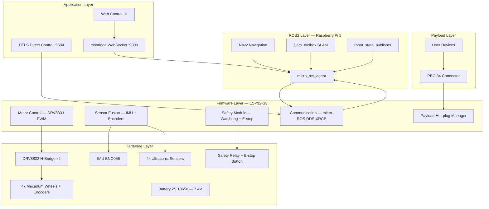
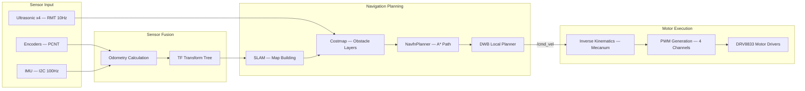
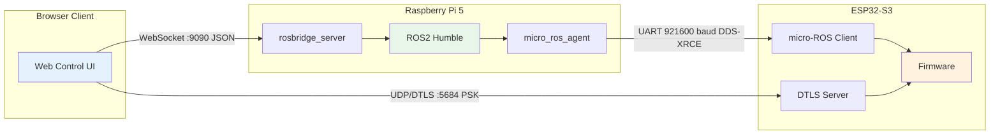
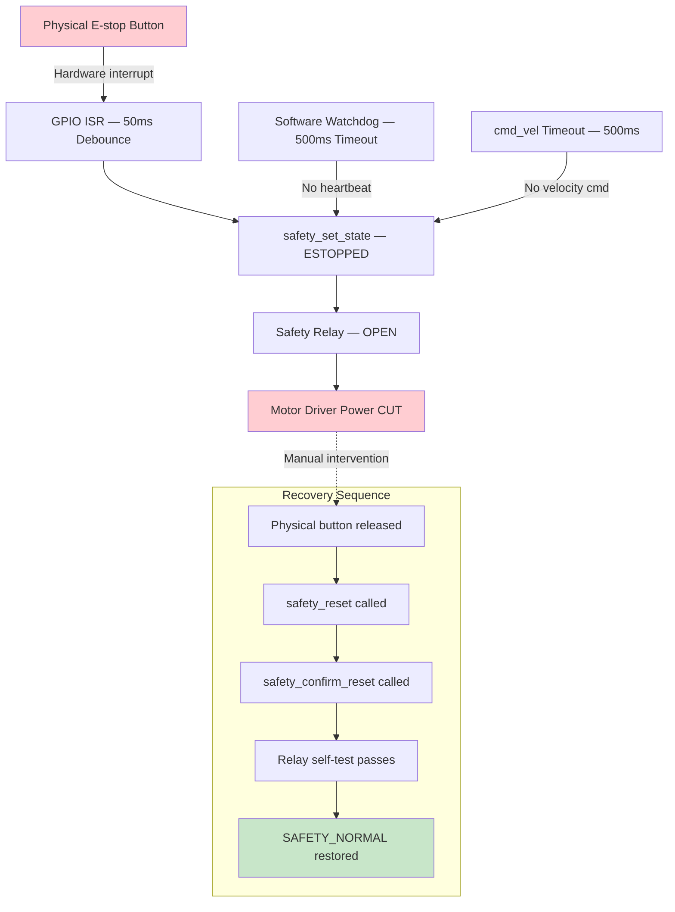
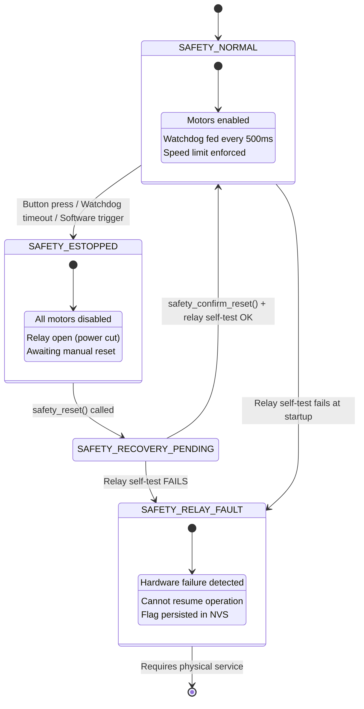
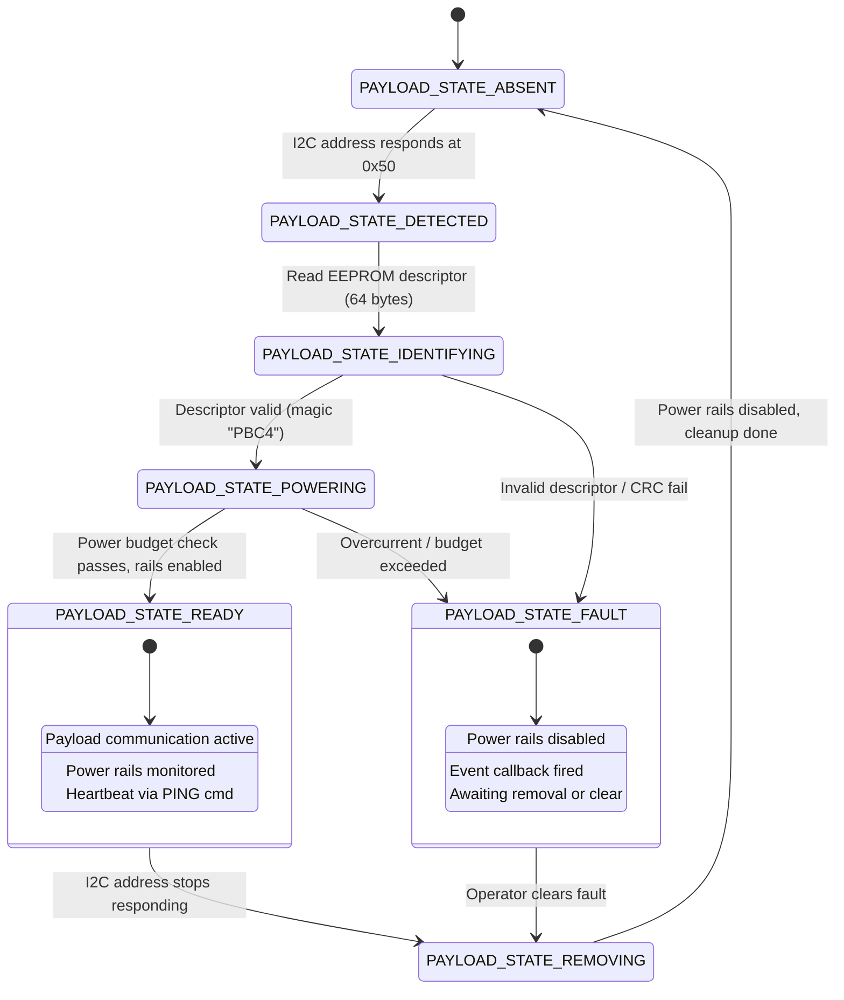

# Architecture Diagrams

Visual reference for the robot platform system architecture. Diagrams use Mermaid syntax and render natively on GitHub.

## System Layer Diagram

## Data Flow Diagram

## Communication Topology

## Safety Chain Diagram

## E-stop State Machine

## Payload Hot-plug State Machine

