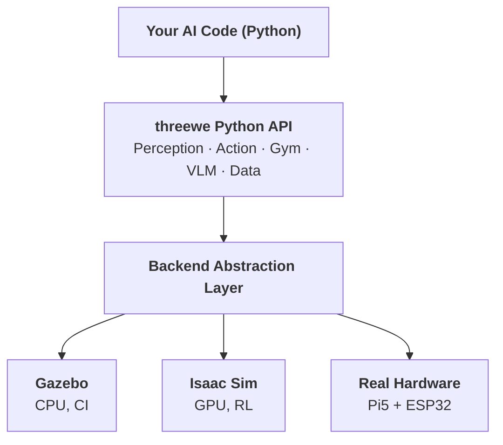

# threewe

[](https://pypi.org/project/threewe/)
[](https://pypi.org/project/threewe/)
[](https://github.com/3we-org/3we-robot-platform/blob/main/LICENSE)

**AI-First Python API for embodied robotics research.**
Same code runs in Gazebo, Isaac Sim, and on real hardware — zero modifications.

```python
from threewe import Robot

async with Robot(backend="gazebo") as robot:      # or "real" / "isaac_sim"
    image = robot.get_camera_image()              # numpy (H,W,3) uint8
    await robot.move_to(x=2.0, y=1.5)            # Nav2 planning, transparent
    await robot.execute_instruction("find the red bottle")  # VLM integration
```

---

## Why threewe?

| Feature | threewe | TurtleBot | Isaac Lab |
|---------|---------|-----------|-----------|
| AI-First Python API | 5 lines | 60+ lines (ROS2) | Sim only |
| Sim2Real same code | Gazebo / Isaac / Real | No | No |
| Open hardware (<$500) | Full BOM + PCB | $1200+ | N/A |
| Edge AI (Hailo-8L) | 13 TOPS on Pi 5 | No | N/A |
| Gymnasium compatible | `make("3we/Navigation-v1")` | No | Yes |
| VLM/VLA native | `execute_instruction()` | No | Limited |

---

## Installation

```bash
pip install threewe            # core API
pip install threewe[sim]       # + Gymnasium environments
pip install threewe[ai]        # + VLM/VLA integration (OpenAI, Hailo)
pip install threewe[all]       # everything
```

Requires Python 3.10+.

---

## Key Features

### Perception

```python
image = robot.get_camera_image()    # (H, W, 3) uint8
rgbd = robot.get_rgbd_image()       # .rgb + .depth (meters)
scan = robot.get_lidar_scan()       # .ranges (N,) float32
pose = robot.get_pose()             # .x, .y, .theta
obs = robot.get_observation()       # dict ready for RL/VLA models
```

### Navigation

```python
await robot.move_to(x=3.0, y=1.0)       # Nav2 path planning
await robot.move_forward(1.5)            # straight line
await robot.rotate(1.57)                 # radians, CCW positive
await robot.explore(timeout=60.0)        # frontier exploration
```

### AI Integration

```python
# VLM instruction execution
result = await robot.execute_instruction("go to the kitchen")

# RL policy deployment
action = policy(robot.get_observation())
robot.execute_action(action)             # normalized [-1,1] → velocity

# VLA model inference
from threewe.ai import VLARunner
vla = VLARunner.from_pretrained("lerobot/pi0fast-so100")
action = vla.predict(obs, instruction="pick up the cup")
```

### Gymnasium Environments

```python
import gymnasium
env = gymnasium.make("3we/Navigation-v1", backend="gazebo")
obs, info = env.reset()
obs, reward, terminated, truncated, info = env.step(action)
```

### Data Collection

```python
from threewe.data import TrajectoryRecorder
recorder = TrajectoryRecorder(robot, fps=30)
trajectory = await recorder.record_episode()
trajectory.save("demo_001.hdf5")
```

---

## Architecture



---

## CLI

```bash
threewe launch --backend gazebo --scene office_v2
threewe benchmark run --task pointnav --episodes 100
threewe sim2real report --backend gazebo
threewe hal list
```

---

## Hardware (Standard Research Kit)

| Component | Model | Purpose |
|-----------|-------|---------|
| Compute | Raspberry Pi 5 (8GB) + Hailo-8L | 13 TOPS edge AI |
| MCU | ESP32-S3 + micro-ROS | Real-time control 50Hz |
| LiDAR | LD06 | 2D SLAM |
| IMU | BNO055 | 9-axis fusion |
| Drive | Mecanum wheels x4 | Omnidirectional |
| Camera | 1080P 170 deg fisheye | Visual input |
| **Total** | **<$500 USD** | All standard parts |

Full BOM, PCB files, and assembly guide: [hardware/](https://github.com/3we-org/3we-robot-platform/tree/main/hardware)

---

## Documentation

- [Getting Started (AI Researchers)](https://github.com/3we-org/3we-robot-platform/blob/main/docs/getting_started_ai.md)
- [Getting Started (Hardware)](https://github.com/3we-org/3we-robot-platform/blob/main/docs/getting_started_basic.md)
- [API Reference](https://github.com/3we-org/3we-robot-platform/blob/main/docs/api_reference.md)
- [Sim2Real Validation](https://github.com/3we-org/3we-robot-platform/blob/main/docs/architecture-diagrams.md)
- [Assembly Guide](https://github.com/3we-org/3we-robot-platform/blob/main/docs/assembly_guide.md)

---

## License

Apache-2.0 — see [LICENSE](https://github.com/3we-org/3we-robot-platform/blob/main/LICENSE).
